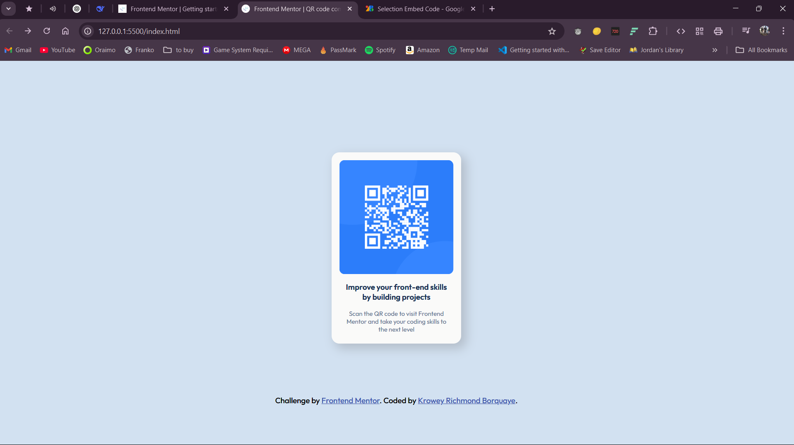

# QR Code Component | Frontend Mentor

<div align="center">
  Solution to <a href="https://www.frontendmentor.io/challenges/qr-code-component-iux_sIO_H" target="_blank">Frontend Mentor Challenge</a>
</div>



## Features
- Responsive QR code card
- Semantic HTML5 markup
- Mobile-first workflow
- Accessible color contrast
- CSS Flexbox centering

## Built With
- HTML5
- CSS3 (Flexbox)
- Google Fonts (Outfit)

## What I Learned
```css
/* Vertical centering technique */
body {
  height: 100vh;
  display: flex;
  justify-content: center;
  align-items: center;
}

/* Card styling */
.card {
  box-shadow: 8px 8px 20px 2px rgba(88, 82, 82, 0.25);
  border-radius: 15px;
}